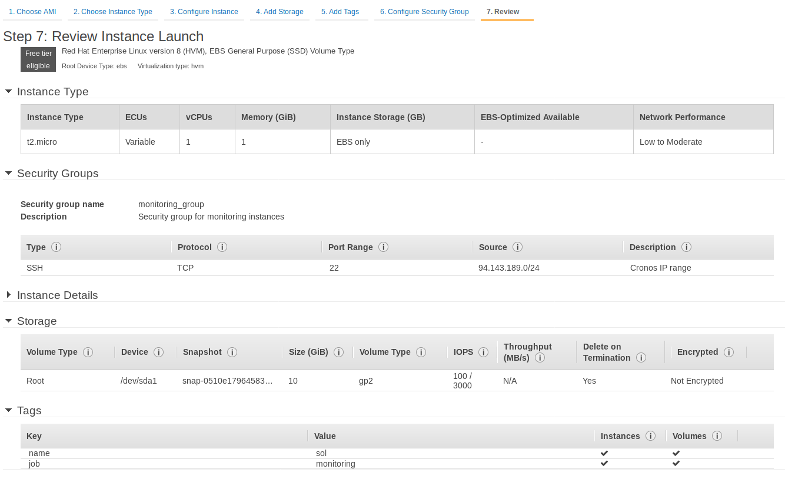
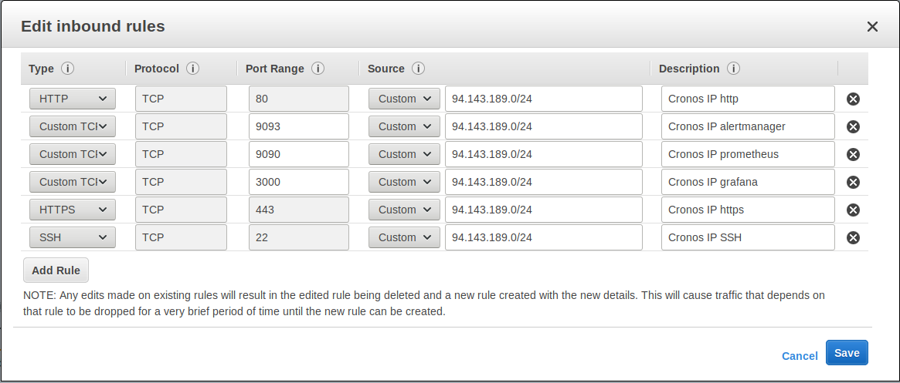
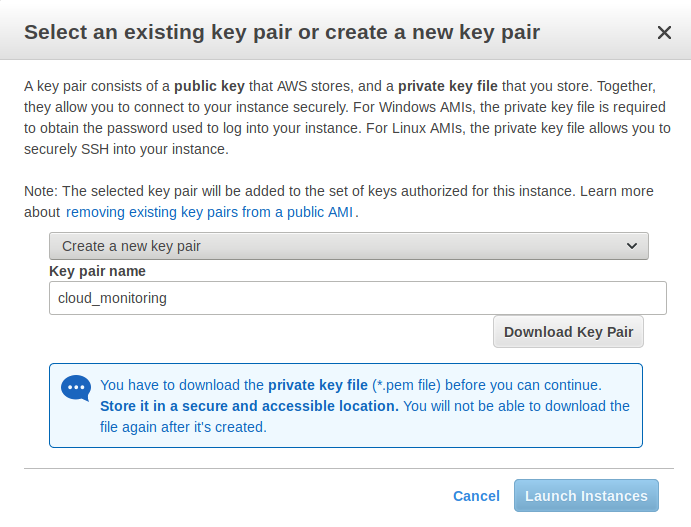
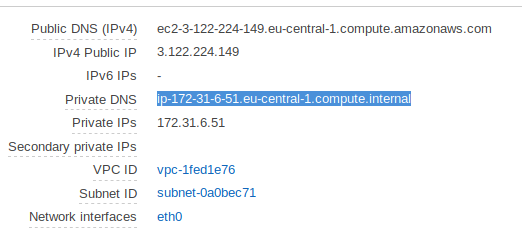
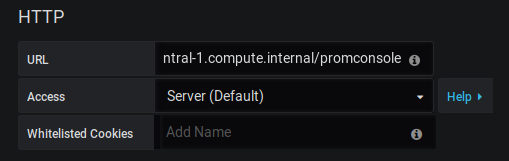

# Monitoring Setup in Amazon AWS 

Stack:

- Amazon AWS
- Podman for the container layer
- Prometheus  to collect metrics
- Grafana for the dashboards
- Alertmanager to manage and send notifications
- nginx for reverse proxy
- TimescaleDB + Postgres to keep the postgres history 


## Amazon

Log in to amazon aws. Choose an availability zone on the top right (ex: "Frankfurt", "Ireland").

Examine the overview of services available, and choose "EC2". Fill in the options and start the virtual machine. See example options in the picture below.




Edit the security group to allow connections to port 80 and 443. While setting up the server we can allow port 9090, 3000 and 9093 to be open to do testing, but these should be closed after done with the setup.




When you click launch, amazon will ask to setup SSH keys. Choose "create new pair", fill in a name and click "Download key pair."



Copy the key pair to your .ssh dir and give the correct rights.

```bash
cp ~/Downloads/cloud_monitoring.pem ~/.ssh/cloud_monitoring.pem
chmod 400 ~/.ssh/cloud_monitoring.pem
```

Edit .ssh/config   to add the identity file or add your connect information to your favourite ssh client.

```bash
HOST 3.122.224.149 ec2sol
  IdentityFile ~/.ssh/cloud_monitoring.pem
```


### Running the pod

scp "monitoring.yaml" (the one in this git repo) to the host

```
yum -y install podman
podman play kube monitoring.yaml
```

At this point you can browse amazon_dns:3000, amazon_dns:9090 and amazon_dns:9093 to check out grafana, prometheus and alertmanager.

## Prometheus Config

https://github.com/prometheus/prometheus

```bash
podman exec -it prometheus /bin/sh
```

vi /etc/prometheus/alert.rules.yml

Populate it with examples from this website: https://awesome-prometheus-alerts.grep.to/rules.html

In this git there's an example alert.rules.yml file you can copy instead.

```yaml
cat <<EOT > /etc/prometheus/prometheus.yml
global:           
  scrape_interval:     15s 
  evaluation_interval: 15s                                                                            
alerting:                                             
  alertmanagers:
    - scheme: http                                                 
      path_prefix: /alerts                                                                 
      static_configs:                                                                    
        - targets:                                                                         
          - 127.0.0.1:9093                                                                     
rule_files:                                                                               
  - /etc/prometheus/alert.rules.yml                                                       
scrape_configs:                                                    
  - job_name: 'dummy'  # This is a default value, it is mandatory. 
    file_sd_configs:                                               
      - files:                                                     
        - /etc/prometheus/targets.json
EOT
```

Add new targets here in json format.

```yaml
cat <<EOT > /etc/prometheus/targets.json
[
  {
    "targets": [ "localhost:9100"],
    "labels": {
      "env": "monitoring",
      "job": "node"
    }
  }
]
EOT
```

Exit the container and restart

```
podman restart prometheus
```

Save the container state

```bash
podman commit prometheus initial_state_prometheus
```


## Alertmanager

#https://github.com/prometheus/alertmanager/

```bash
podman exec -ti alertmanager /bin/sh
```

Fill in your smtp info. 

```yaml
cat <<EOT > /etc/alertmanager/alertmanager.yml
global:
  resolve_timeout: 1m

route:
  group_by: ['env','node']
  group_wait: 10s
  group_interval: 10s
  repeat_interval: 6h
  receiver: standby

receivers:

- name: standby
  email_configs:
  - to: 'pablo.hendrickx@exitas.be'
    send_resolved: false
    from: 'alert@hendrickx.dev'
    smarthost: 'smtp.eu.mailgun.org:587'
    auth_username: 'alert@hendrickx.dev'
    auth_password: '-------'
    auth_identity: 'alert@hendrickx.dev'

inhibit_rules:

  - source_match:
      severity: 'critical'
    target_match:
      severity: 'warning'
    equal: ['alertname', 'dev', 'instance']
EOT
```

Exit, restart and save the alertmanager state.

```
podman restart alertmanager
podman commit alertmanager initial_state_alertmanager
```


## Installing nginx

#https://devconnected.com/how-to-setup-grafana-and-prometheus-on-linux/

```
sudo yum install epel-release -y
sudo yum install nginx -y
sudo systemctl start nginx
sudo systemctl enable nginx
setsebool -P httpd_can_network_connect 1
```

vi /etc/nginx/nginx.conf

```
        location / {
                proxy_pass http://localhost:3000/;
        }
        location /grafana/ {
                proxy_pass http://localhost:3000/;
        }
        location /promconsole/ {
                proxy_pass http://localhost:9090/promconsole/;
        }
        location /alerts/ {
         proxy_pass http://localhost:9093/alerts/;
        }
```

```
systemctl restart nginx
```


##### Enabling SSL on nginx

https://www.itzgeek.com/how-tos/linux/centos-how-tos/how-to-setup-lets-encrypt-ssl-certificate-with-nginx-on-rhel-8-centos-7-rhel-7.html


## Grafana

#https://grafana.com/docs/installation/docker/

Go to amazon AWS, and open the settings of this EC2 instance. Copy the amazon **internal** DNS 



Browse to: amazon_ip_address/grafana

login,  pw: admin:admin

Create two new datasources, one for prometheus and one for alertmanager. Use the amazon internal DNS in the url option and use the path we configured in nginx.



For alertmanager: http://amazon_internal_dns:9093/alerts/#/alerts

Import these boards and select our newly created data sources.

Useful dashboards:

- Node Details: https://grafana.com/grafana/dashboards/10879
- Node Aquarium: https://grafana.com/grafana/dashboards/405
- For postgres: https://grafana.com/grafana/dashboards/6742
- For alertmanager: https://grafana.com/grafana/dashboards/8010


Config documentation: https://prometheus.io/docs/visualization/grafana/